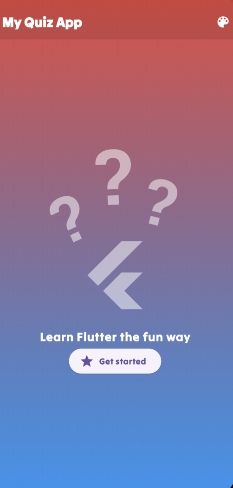
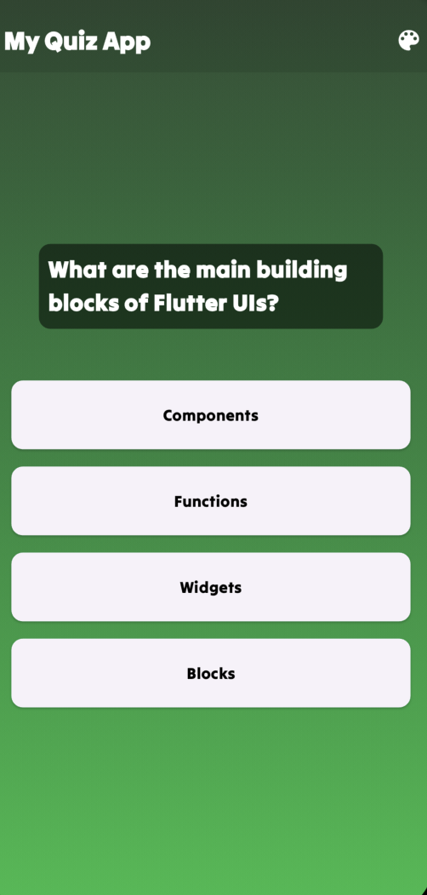
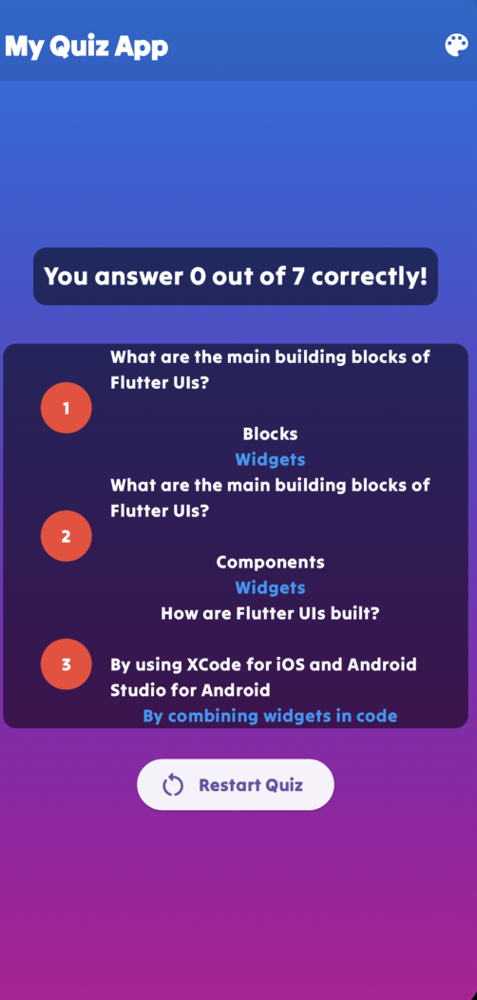

# Quiz app

## Overview

The Quiz App is an interactive mobile application that presents users with a series of questions related to Flutter and Dart programming. Users can test their knowledge, learn new concepts, and track their progress over time.

## Features

- Questionnaire: Engage with a variety of questions covering different aspects of Flutter and Dart.
- Scoring: Receive immediate feedback on correct and incorrect answers once the quiz is completed.
- Educational: Learn about stateless and stateful widgets, passing values to constructors, and more.

## Getting Started

To get started with the quiz app, follow these steps

1. Clone the Repository:

```
git clone https://github.com/auza0002/quiz_app_flutter.git
```

2. Install Dependencies:

```
flutter pub get
```

3. Run the App:

```
flutter run
```

## Widgets and State Management

This app serves as an excellent resource for understanding Flutter concepts such as stateless and stateful widgets, as well as passing different values to constructors. Here are some key points:

- Stateless Widgets :
  - Represent static or unchanging UI elements.
  - Used for parts of the user interface that don't change dynamically.
- Stateful Widgets :
  - Maintain state that might change during the liftime of the widget.
  - Ideal for dynamic UI elements that need to update in response to user interactions.
- Constructor Parameters :
  - Learn how to pass various values, such ass functions, strings, and colors, to widget constructors.
  - Explre the flexibitilty of widget customization through constructor parameters.

## App Runing Photos

### Home Page

The Home Page is the entry point of the Quiz App, featuring an engaging interface with dynamic widgets and smooth animations

- AnimatedContainer
  The AnimatedContainer is a key element on the Home Page, providing a visually appealing transition between two colors.

```
AnimatedContainer(
          duration: const Duration(seconds: 1),
          decoration: BoxDecoration(
            gradient: LinearGradient(
              begin: Alignment.topCenter,
              end: Alignment.bottomCenter,
              colors: [_colorTop, _colorBottom],
            ),
          ),
          child: SafeArea(
            child: screenWidget,
          ),
        ),
```

- Getting Random Colors clicking on the color lens

```
  Color _colorTop = Colors.red;
  Color _colorBottom = Colors.blue;
  Color getColor() {
    return Color((math.Random().nextDouble() * 0xFFFFFF).toInt())
        .withOpacity(1.0);
  }
```



## Questions Screen

- Dynamic Question Rendering
  Display quiz question dynamically, adapting the user'sprogress
- Answer Handling
  Capture and process user-selected answert through the responsive callback functio

```class Questions extends StatefulWidget {
  const Questions({Key? key, required this.onSelectedAnswer}) : super(key: key);

  final void Function(String answer) onSelectedAnswer;

  @override
  State<Questions> createState() => _QuestionsState();
}
```

```
 var currentQuestionIndex = 0;

  void answerQuestion(String selectedAnswer) {
    widget.onSelectedAnswer(selectedAnswer);
    setState(() {
      currentQuestionIndex++;
    });
  }
```



## Questions Summary

- Visual Summary
  Display a visual summary of quiz questions, users answer and correct answer
- Color-Coded indicators
  Utilize color-coded indicators to disquin between correct and incorrect user answer

```
class QuestionsSummary extends StatelessWidget {
  const QuestionsSummary({Key? key, required this.questionsSummary}) : super(key: key);

  final List<Map<String, Object>> questionsSummary;

  // Additional methods...
}
```

```
bool getColorsByAnswer(String answer, String userAnswer) {
  return answer == userAnswer;
}
```


